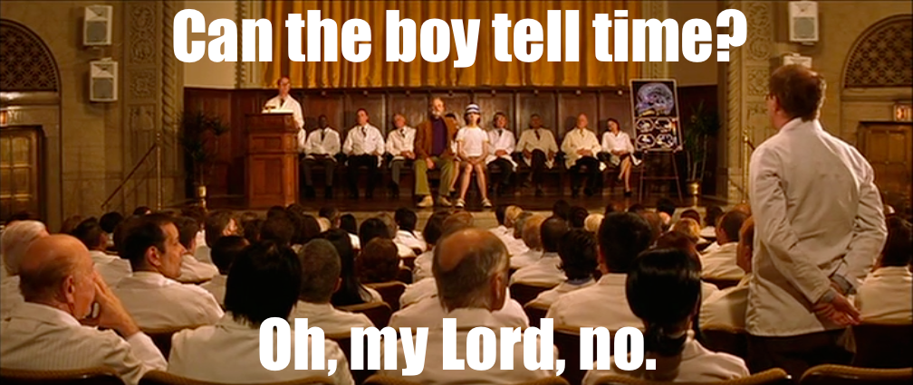

# simple-time

A Clojure date & time library for people who can't tell time. It's an opinionated, bare-bones, datetime and timespan library.

## Artifacts

`simple-time` is available from clojars:

With Leiningen:

``` clj
[simple-time "0.2.0"]
```

With Maven:

``` xml
<dependency>
  <groupId>simple-time</groupId>
  <artifactId>simple-time</artifactId>
  <version>0.2.0</version>
</dependency>
```

## Usage

[Full API docs here](http://mbossenbroek.github.io/simple-time/simple-time.core.html)

`simple-time` has two things: [`datetime`](http://mbossenbroek.github.io/simple-time/simple-time.core.html#var-datetime) and [`timespan`](http://mbossenbroek.github.io/simple-time/simple-time.core.html#var-timespan). [`datetime`](http://mbossenbroek.github.io/simple-time/simple-time.core.html#var-datetime) is a point in time; [`timespan`](http://mbossenbroek.github.io/simple-time/simple-time.core.html#var-timespan) is a duration of time.

Everything you'll need is in `simple-time.core`. There are a number of overlaps with `clojure.core`, so you'll probably want to use an alias.

``` clj
(use 'simple-time.core)
```

### Making time

You can create a [`datetime`](http://mbossenbroek.github.io/simple-time/simple-time.core.html#var-datetime) in a few different ways:

``` clj
(datetime) ; the current time
(datetime 1390631873847) ; a java epoch (ms since Jan 1, 1970)
(datetime 2014 1 2) ; just the date
(datetime 2014 1 2 12 34 56) ; date & time
(datetime 2014 1 2 12 34 56 789) ; date & time w/ milliseconds
```

### What time is it?

``` clj
(now) ; the current datetime
(today) ; the current date
(utc-now) ; the current datetime in UTC
```

### What day is it?

This is how to get the constituent parts of a `datetime`

``` clj
=> (datetime->year (datetime 2014 1 2))
2014

=> (datetime->month (datetime 2014 1 2))
1

=> (datetime->day (datetime 2014 1 2))
2

=> (datetime->hour (datetime 2014 1 2 12 34 56))
12

=> (datetime->minute (datetime 2014 1 2 12 34 56))
34

=> (datetime->second (datetime 2014 1 2 12 34 56))
56

=> (datetime->millisecond (datetime 2014 1 2 12 34 56 789))
789
```

### How long does it take?

A [`timespan`](http://mbossenbroek.github.io/simple-time/simple-time.core.html#var-timespan) represents a length of time. There are a few ways to create them:

``` clj
(timespan) ; 0 ms
(timespan 100) ; 100 ms
(timespan 1 2 3) ; 1 hr, 2 min, 3 sec
(timespan 1 2 3 4) ; 1 day, 2 hr, 3 min, 4 sec
(timespan 1 2 3 4 5) ; 1 day, 2 hr, 3 min, 4 sec, 5 ms

(days->timespan 42) ; 42 days
(hours->timespan 42) ; 42 hours
(minutes->timespan 42) ; 42 minutes
(seconds->timespan 42) ; 42 seconds
(milliseconds->timespan 42) ; 42 milliseconds
```

### But what is that in days/hours/etc?

These methods return the entire duration, expressed as days, hours, minutes, seconds, or milliseconds. The return value will be a fractional value - use double or float as appropriate.

``` clj
=> (timespan->total-days (timespan 1 2 3 4 5))
2084089/1920000
=> (double *1)
1.085463020833333

=> (timespan->total-minutes (timespan 1 2 3 4 5))
6252267/4000
=> (double *1)
1563.06675
```

### Just the hours/minutes/seconds

This is how to retrieve the constituent parts of a timespan:

``` clj
=> (timespan->days (timespan 1 2 3 4 5))
1

=> (timespan->hours (timespan 1 2 3 4 5))
2

=> (timespan->minutes (timespan 1 2 3 4 5))
3

=> (timespan->seconds (timespan 1 2 3 4 5))
4

=> (timespan->milliseconds (timespan 1 2 3 4 5))
5
```

### Strings

Serialization with simple-time is simple. There are just two functions you'll need: [`format`](http://mbossenbroek.github.io/simple-time/simple-time.core.html#var-format) and [`parse`](http://mbossenbroek.github.io/simple-time/simple-time.core.html#var-parse). `format` converts a `datetime` to a string and `parse` reads a string into a `datetime` or `timespan`, as appropriate.

Each of them takes the value to format or parse and an optional formatter:

``` clj
=> (format (datetime 2014 1 2 12 34 56 789))
"2014-01-02T12:34:56.789"

=> (t/format (t/datetime 2014 1 2 12 34 56 789) "YYYYMMdd")
"20140102"

=> (format (datetime 2014 1 2 12 34 56 789) :medium-date-time)
"Jan 2, 2014 12:34:56 PM"

(parse "2014-01-02T12:34:56.789") -> (datetime 2014 1 2 12 34 56 789)
(parse "20140102" "YYYYmmDD") -> (datetime 2014 1 2)
(parse "Jan 2, 2014 12:34:56 PM" :medium-date-time) -> (datetime 2014 1 2 12 34 56)
```

Formatter can be a string or a keyword for a predefined formatter. Use [`format-all`](http://mbossenbroek.github.io/simple-time/simple-time.core.html#var-format-all) to explore the predefined formats. Joda-time formatters also work.

If you really want to, you can create a [`formatter`](http://mbossenbroek.github.io/simple-time/simple-time.core.html#var-formatter), but the only reason is for your own code organization.

### Let's do some math

With simple-time, you can add datetimes and timespans together just as you would with numbers. Add a `timespan` to a `datetime` and you get another `datetime`. Subtract a `datetime` from another `datetime` and you get a `timespan` representing the duration between them.

``` clj
; Allowed combinations
(+ datetime) -> datetime
(+ datetime & timespan*) -> datetime

(+) -> (timespan 0)
(+ timespan) -> timespan
(+ timespan & timespan*) -> timespan

; Examples
(+ (datetime 2013 12 25) (days->timespan 7)) -> (datetime 2014 1 1)
(+ (hours->timespan 1) (minutes->timespan 2)) -> (timespan 1 2 0)

; Allowed combinations
(- timespan) -> -timespan
(- datetime datetime) -> timespan
(- datetime & timespan*) -> datetime
(- timespan & timespan*) -> timespan

; Examples
(- (datetime 2014 1 1) (days->timespan 7)) -> (datetime 2013 12 25)
(- (datetime 2014 1 1) (datetime 2013 12 25)) -> (days->timespan 7)
(- (datetime 2013 12 25) (datetime 2014 1 1)) -> (days->timespan -7)

(duration (timespan -100)) -> (timespan 100)
```

Months and years can't be in timespans, so we use this instead:

``` clj
(add-years (datetime 2014 1 1) 6) -> (datetime 2020 1 1)
(add-years (datetime 2012 2 29) 1) -> (datetime 2013 2 28)

(add-months (datetime 2014 1 1) 6) -> (datetime 2014 7 1)
(add-months (datetime 2014 1 31) 1) -> (datetime 2014 1 28)
```

There's also `add-days`, `add-hours`, `add-minutes`, `add-seconds`, and `add-milliseconds` for consistency.

### Comparisons

Compare datetimes and timespans just like you would numbers. Mixing & matching won't work - they all need to be the same type.

``` clj
(= (datetime 2014 1 1) (datetime 2014 1 1))
(not= (datetime 2014 1 1) (datetime 2014 1 2))
(< (datetime 2014 1 1) (datetime 2014 1 2))
(> (datetime 2014 1 2) (datetime 2014 1 1))
(<= (datetime 2014 1 1) (datetime 2014 1 1) (datetime 2014 1 2))
(>= (datetime 2014 1 2) (datetime 2014 1 2) (datetime 2014 1 1))
```

### Misc

Some random, but useful stuff. Also look at [`with-precision`](http://mbossenbroek.github.io/simple-time/simple-time.core.html#var-with-precision).

``` clj
(datetime->date (datetime 2014 1 2 12 34 56)) -> (datetime 2014 1 2)

(datetime->time-of-day (datetime 2014 1 2 12 34 56)) -> (timespan 12 34 56))
(datetime->time-of-day (datetime 2014 1 2 12 34 56 789)) -> (timespan 0 12 34 56 789))

=> (datetime->day-of-week (datetime 2014 1 6)) ; Monday
1
=> (datetime->day-of-week (datetime 2014 1 5)) ; Sunday
7

=> (datetime->day-of-year (datetime 2014 1 1))   ; New year's day
1
=> (datetime->day-of-year (datetime 2014 12 31)) ; New year's eve
365
=> (datetime->day-of-year (datetime 2012 12 31)) ; Leap year
366

=> (days-in-month 2014 1)
31
=> (days-in-month 2014 2)
28
=> (days-in-month 2012 2)
29

(range (datetime 2014 1 1)) ; infinite seq
(range (datetime 2014 1 1) (datetime 2014 1 4)) ; seq of 3 days
(range (datetime 2014 1 1) (datetime 2014 1 4) 2) ; every 2 days
(range (datetime 2014 1 1) (datetime 2013 12 25) -2) ; move backwards in time
(range (datetime 2014 1 1 0 0 0) (datetime 2014 1 1 6 0 0) (hours->timespan 2)) ; move by any duration
```

## Credits

simple-time is based on .Net's [DateTime](http://msdn.microsoft.com/en-us/library/system.datetime(v=vs.110).aspx) and [TimeSpan](http://msdn.microsoft.com/en-us/library/system.timespan(v=vs.110).aspx), which are awesome. When using them, I never once experienced the pain that I've endured once switching to the multitude of JVM libraries.

## Motivations

JodaTime is very class-heavy. There's DateTime, DateMidnight, LocalDate, LocalTime, LocalDateTime, Instant, and Partial - just for representing a point in time. For timespans, there's Interval, Period, and Duration. We haven't even talked about Chronologies yet - when's the last time you needed to figure out dates in a Coptic calendar? (If you're writing programs for ancient Egyptian farmers, simple-time is not the library for you.) And then there's Years, YearMonth, YearMonthDay, Weeks, Hours, Seconds... the list goes on. In the jar I have now, I'm counting 232 different classes and none of them seem to play well with one another.

This is likely because I'm using a language that doesn't have intellisense (at least not in the Java sense of the word). JodaTime was designed to have a fluent interface. Each object has a set of things you can do to it - easily discoverable via intellisense. If you took all of those functions from all of the different classes and threw them in the same bag, it would become incredibly difficult to determine what goes with what. Libraries like JodaTime work very well with a type system and intellisense - of which Clojure has neither.

The naming conventions used in simple-time are designed to eliminate that ambiguity. `datetime->hour` takes a `datetime` and returns a number. `hours->timespan` takes a number and returns a `timespan`. You'll never get a crazy Hours type or some intermediate calculation. The only things you'll ever see are datetime, timespan, numbers, and strings.

### But you use JodaTime??

It's better than `java.util.Date` and `java.util.Calendar`

## Future Work

TimeZone is notably absent from simple-time at the moment. It will be added soon. Chronology will never be added.

## Release Notes

  * 0.2.0 - Fix epoch handling and default parsing to be in UTC
  * 0.1.1 - Added range
  * 0.1.0 - Initial commit

## License

Copyright © 2014 Matt Bossenbroek

Distributed under the Eclipse Public License, the same as Clojure.
